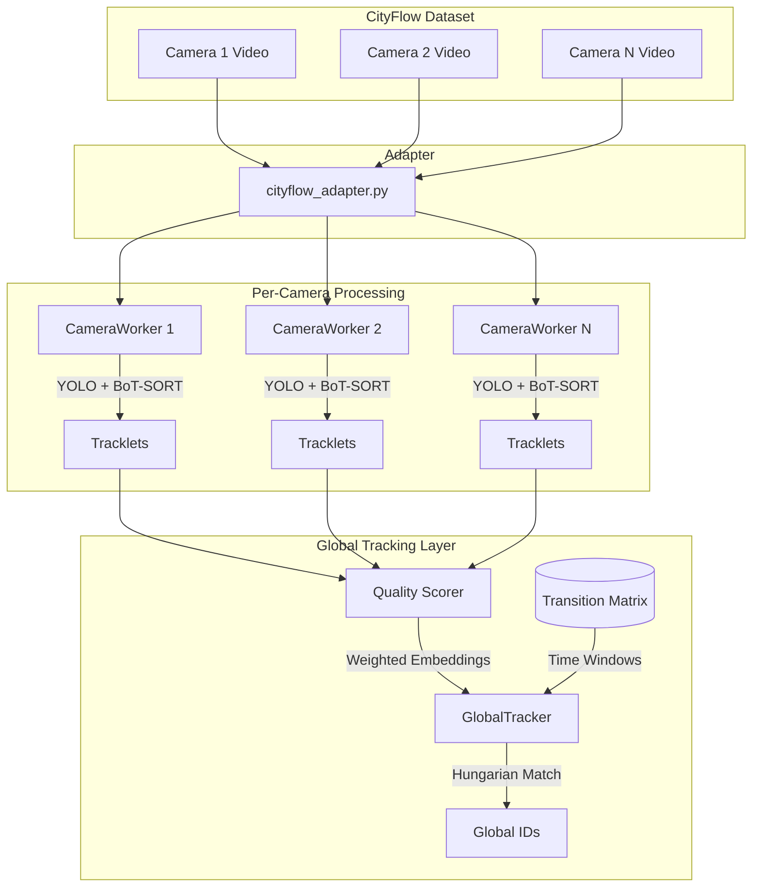

# CityFlow Integration & Architectural Innovations

To adapt our Multi-Camera Tracking (MTMC) system to the real-world complexities of the **CityFlow Dataset**, we are introducing several architectural innovations. CityFlow provides real traffic camera footage across multiple intersections, which means we can no longer rely on simple 2D distance calculations for spatio-temporal scoring.

## 1. Zone-Based Spatio-Temporal Transition Matrix

Instead of assuming vehicles travel in a straight line at a constant speed, we will implement a **Transition Matrix**.

*   **Concept:** We define the topology of the camera network. For example, if Camera 1 is at Intersection A and Camera 2 is at Intersection B, we know the minimum and maximum travel times between them.
*   **Implementation:** The `GlobalTracker` will use a `transition_matrix.json` file.
    *   `T(cam_A, cam_B) = [min_time, max_time]`
    *   If a vehicle appears in `cam_B` outside this time window relative to its exit from `cam_A`, the spatio-temporal score (`S_st`) is 0.
    *   If it falls within the window, `S_st` is calculated using a Gaussian distribution centered on the expected average travel time.

## 2. Tracklet Quality Scoring for Re-ID

In real-world footage, vehicles are often occluded or far away. Averaging all crops equally degrades the Re-ID embedding.

*   **Concept:** We will score each crop in a tracklet based on its quality before extracting features.
*   **Implementation:**
    *   **Size Score:** Larger bounding boxes generally contain more detail.
    *   **Confidence Score:** The YOLO detection confidence.
    *   **Position Score:** Crops near the center of the frame are usually less distorted by lens effects than those at the edges.
    *   The final Re-ID embedding for the tracklet will be a **weighted average** of the crop embeddings, heavily favoring high-quality crops.

## 3. CityFlow Adapter

CityFlow provides data in a specific format (videos in folders, annotations in text files). We need an adapter to feed this into our pipeline.

*   **Implementation:** `cityflow_adapter.py` will:
    1.  Read the CityFlow directory structure.
    2.  Parse the `calibration.txt` (if needed for advanced 3D projection, though we will stick to 2D + Transition Matrix for now).
    3.  Feed the video frames into our `CameraWorker` threads, simulating real-time streams.

## Updated Architecture Diagram

