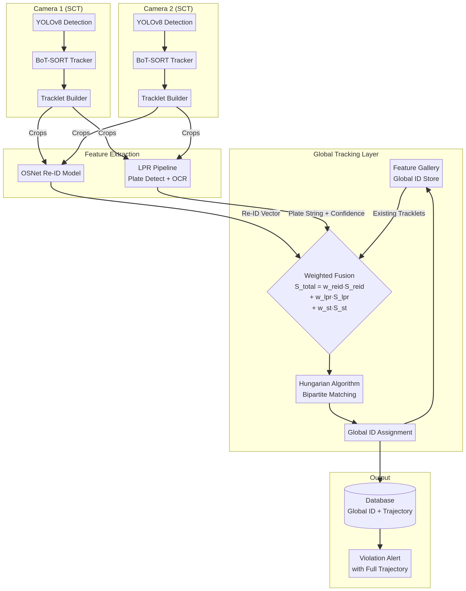
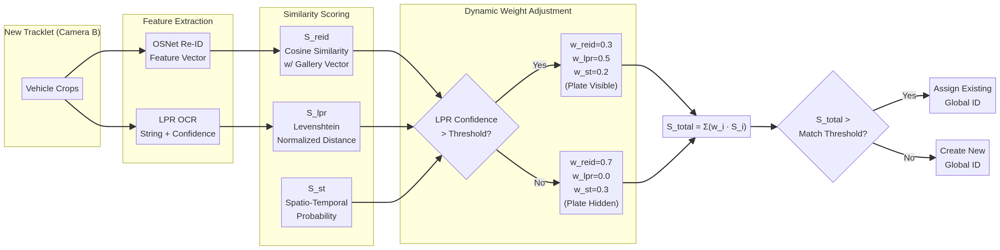

# Multi-Camera Vehicle Tracking & Re-Identification: System Design Proposal

**Project**: Traffic Violation Detection — Multi-Camera Extension
**Repository**: `tungooxx/Traffic-violation-detection`

---

## 1. Current System Analysis

After examining the repository, the existing system operates as a **single-camera, single-scene** pipeline. The architecture is well-structured and consists of the following components:

| Component | File | Technology | Role |
|---|---|---|---|
| Vehicle Detection | `yolo-detect.py` | YOLOv5 | Detects cars, motos, trucks, buses |
| Helmet Detection | `yolo-detect.py` | Ultralytics YOLO | Detects helmet/no-helmet violations |
| Intra-Camera Tracking | `sort.py` | SORT + Kalman Filter | Assigns local track IDs per frame |
| Plate Detection | `process.py` | YOLOv5 custom | Crops license plate from vehicle image |
| Plate OCR | `process.py` | YOLOv5 custom | Reads alphanumeric characters from plate |
| Database & Alerts | `workWithDatabase.py` | MySQL + SMTP | Queries owner info and sends email |

The critical limitation is that the **SORT tracker resets its ID counter per camera session**. A vehicle that crosses Camera 1 and later appears in Camera 2 will receive a completely different local ID. There is no mechanism to link these two observations as the same vehicle, making it impossible to build a cross-camera trajectory or confirm that a violating vehicle from Camera 1 was re-sighted at Camera 2.

---

## 2. Proposed Feature: Multi-Target Multi-Camera (MTMC) Tracking

The proposed feature introduces a **Global Tracking Layer** that sits above the existing single-camera tracking pipeline. This layer is responsible for linking tracklets (stable sequences of bounding boxes) from different cameras into a single, persistent **Global Vehicle ID**.

The system uses a **weighted fusion** of three signals to determine if a vehicle seen in Camera B is the same as one previously seen in Camera A:

1. **Visual Re-ID Score** (`S_reid`): How visually similar are the two vehicles?
2. **License Plate Score** (`S_lpr`): Do their license plates match?
3. **Spatio-Temporal Score** (`S_st`): Is it physically plausible for the vehicle to travel from Camera A to Camera B in the observed time?

### 2.1 System Architecture

The full MTMC pipeline is illustrated below:



Each camera runs its own independent Single-Camera Tracking (SCT) module. When a tracklet is completed (i.e., the vehicle leaves the camera's field of view), it is passed to the Global Tracking Layer for cross-camera association.

### 2.2 Weighted Fusion Scoring

The core innovation is the **dynamic weighted fusion** system. The total similarity score between two tracklets is computed as:

> **S_total = w_reid · S_reid + w_lpr · S_lpr + w_st · S_st**

The weights are not fixed — they adapt dynamically based on the **confidence of the License Plate OCR**. If a vehicle's plate is clearly visible, the LPR signal is trusted more. If the plate is obscured (e.g., covered in mud, blocked by another vehicle), the system falls back to relying on visual appearance.



The table below summarizes the two primary weight configurations:

| Scenario | `w_reid` | `w_lpr` | `w_st` | Rationale |
|---|---|---|---|---|
| Plate clearly visible (OCR confidence > 0.8) | 0.30 | 0.50 | 0.20 | License plate is the most reliable identifier |
| Plate hidden or low confidence (< 0.8) | 0.70 | 0.00 | 0.30 | Fall back to visual appearance and timing |

The three scoring components are defined as follows:

**S_reid (Visual Appearance Similarity)**: A pre-trained vehicle Re-ID model (OSNet or FastReID) extracts a high-dimensional feature vector from the vehicle crops in a tracklet. The best crops are averaged to produce a single representative embedding. The cosine similarity between the embeddings of two tracklets yields `S_reid ∈ [0, 1]`.

**S_lpr (License Plate Similarity)**: The normalized Levenshtein (edit) distance between the two OCR strings yields `S_lpr ∈ [0, 1]`. A perfect match gives 1.0, and completely different strings give 0.0. This gracefully handles partial OCR errors (e.g., `59N1234` vs `59N1235`).

**S_st (Spatio-Temporal Consistency)**: Given the known physical positions of Camera A and Camera B and the time elapsed between the two tracklets, this score models the probability that the vehicle could have traveled that distance in that time. Vehicles appearing too quickly (teleportation) or too slowly (impossibly long gap) receive a low `S_st` score.

---

## 3. Simulation Environment: CARLA

Developing and testing an MTMC system requires synchronized multi-camera video with **ground truth Global IDs** — data that is extremely difficult to obtain from real-world deployments. The recommended solution is the **CARLA (Car Learning to Act) simulator**.

### 3.1 Why CARLA?

CARLA is an open-source, photorealistic urban driving simulator built on Unreal Engine. It is the industry standard for autonomous driving research and provides several critical advantages:

| Feature | Benefit for This Project |
|---|---|
| Multiple configurable cameras | Place cameras at intersections, simulate any real-world camera network topology |
| Perfect ground truth annotations | Every vehicle has a persistent unique ID across the entire simulation, enabling perfect evaluation of the MTMC system |
| Environmental control | Simulate rain, fog, night, and varying traffic densities to stress-test Re-ID and LPR robustness |
| SUMO co-simulation | Integrate with SUMO traffic simulator for realistic, large-scale traffic flows |
| Python API | Full programmatic control — spawn vehicles, set routes, capture frames, export data |

### 3.2 CARLA vs. Alternatives

| Option | Pros | Cons |
|---|---|---|
| **CARLA** | Photorealistic, multi-camera, full Python API, free | Requires a powerful GPU (6+ GB VRAM), complex setup |
| **SUMO only** | Lightweight, large-scale traffic | No visual output, cannot generate camera images |
| **CARLA + SUMO** | Best of both worlds — realistic visuals + large-scale traffic | Most complex setup |
| **Synthetic video (OpenCV scripted)** | Easiest to set up, no GPU needed | Very unrealistic, poor generalization |
| **Real-world footage** | Most realistic | No ground truth IDs, expensive to annotate |

**Recommendation**: For a research or academic project, **CARLA alone** (without SUMO) is the best starting point. It provides enough realism to train and evaluate the Re-ID model, and the Python API makes it straightforward to set up a multi-camera network.

### 3.3 Proposed CARLA Camera Setup

A typical setup in CARLA `Town03` (urban intersection) would involve placing 3–4 cameras at key points along a road network, with overlapping coverage zones to ensure vehicles transition from one camera's view to another's.

```
[Camera 1]  ----road---->  [Camera 2]  ----road---->  [Camera 3]
 Intersection A              Mid-block                  Intersection B
```

The CARLA Python API script would:
1. Spawn N vehicles with random routes.
2. Attach RGB camera sensors to fixed infrastructure points.
3. Record synchronized video streams and export bounding boxes, global vehicle IDs, and timestamps to a CSV file.
4. This dataset is then used to train the Re-ID model and tune the fusion weights.

---

## 4. Implementation Roadmap

The implementation is broken into four phases, each building on the previous one.

### Phase 1: Simulation Environment Setup
- Install CARLA (recommended version 0.9.15).
- Write a Python script using `carla.Client` to spawn cameras at fixed positions and record multi-camera video with ground truth annotations.
- Generate a dataset of at least 500 vehicle identities across 3+ cameras.

### Phase 2: Single-Camera Tracking Upgrade
- Replace `sort.py` with **BoT-SORT** (available via the `boxmot` library).
- Modify `yolo-detect.py` to output **tracklets** (a list of crops per vehicle ID) instead of per-frame detections.
- The existing `track_list` mechanism (which prevents duplicate processing) maps cleanly to this concept.

### Phase 3: Feature Extraction & Re-ID Integration
- Integrate **OSNet** via the `torchreid` library (`pip install torchreid`).
- Create a new module `reid.py` with a `VehicleReID` class that accepts a list of image crops and returns a feature embedding.
- Adapt `process.py`'s `number_plate_extract` to return both the OCR string and a character-level confidence score.

### Phase 4: Global Tracking Layer
- Create a new module `global_tracker.py` with a `GlobalTracker` class.
- Implement the `compute_similarity(tracklet_a, tracklet_b)` method with the weighted fusion formula.
- Implement the Hungarian algorithm matching using `scipy.optimize.linear_sum_assignment`.
- Update `workWithDatabase.py` to store a new `trajectories` table with columns: `global_id`, `camera_id`, `local_track_id`, `entry_time`, `exit_time`, `plate_number`, `reid_embedding`.

### Phase 5: Violation Trajectory Reporting
- When a violation is detected in Camera 1, the `global_id` is flagged.
- As the vehicle reappears in Camera 2, the system automatically links it to the same `global_id` and appends to the trajectory.
- The email notification in `emailForm.py` is extended to include the full camera-by-camera trajectory of the violating vehicle.

---

## 5. New File Structure

The following new files and modifications are proposed for the repository:

```
Traffic-violation-detection/
│
├── yolo-detect.py          # MODIFIED: Multi-camera loop, calls GlobalTracker
├── sort.py                 # REPLACED: by BoT-SORT (via boxmot)
├── process.py              # MODIFIED: LPR returns confidence score
├── workWithDatabase.py     # MODIFIED: New trajectories table
│
├── reid.py                 # NEW: VehicleReID class using OSNet/torchreid
├── global_tracker.py       # NEW: GlobalTracker class with weighted fusion
├── carla_data_gen.py       # NEW: CARLA simulation data generation script
│
├── weights/
│   ├── vehicle_detect.pt   # Existing
│   ├── plate_detect.pt     # Existing
│   ├── plate_number_detect.pt # Existing
│   ├── helmet.pt           # Existing
│   └── osnet_x1_0_vehicleid.pth  # NEW: Pre-trained vehicle Re-ID weights
│
└── project.ini             # MODIFIED: Multi-camera config sections
```

The `project.ini` configuration file would be extended to support multiple cameras:

```ini
[camera_1]
video = source_videos/cam1.mp4
mask = source_images/mask_cam1.png
linex1 = 100
liney1 = 300
linex2 = 900
liney2 = 300
position_x = 0.0      ; Physical GPS/map coordinate for S_st scoring
position_y = 0.0

[camera_2]
video = source_videos/cam2.mp4
mask = source_images/mask_cam2.png
linex1 = 150
liney1 = 280
linex2 = 850
liney2 = 280
position_x = 500.0
position_y = 0.0

[global_tracker]
reid_weight = 0.3
lpr_weight = 0.5
st_weight = 0.2
lpr_confidence_threshold = 0.8
match_threshold = 0.6
```

---

## 6. Summary

The proposed MTMC system is a natural and powerful extension of the existing traffic violation detection pipeline. By introducing a Global Tracking Layer with a dynamically weighted fusion of visual Re-ID and License Plate Recognition, the system can robustly track vehicles across cameras even when plates are obscured. The CARLA simulator provides the ideal controlled environment to generate training data and validate the system before real-world deployment.

| Capability | Current System | Proposed System |
|---|---|---|
| Vehicle detection | Single camera | Multiple cameras |
| Tracking scope | Intra-camera only (SORT) | Cross-camera (BoT-SORT + GlobalTracker) |
| Vehicle identity | Local track ID (resets per session) | Persistent Global ID |
| Re-identification | None | OSNet visual Re-ID + LPR fusion |
| Plate occlusion handling | None | Dynamic weight fallback to Re-ID |
| Trajectory | Single camera segment | Full multi-camera trajectory |
| Simulation environment | None | CARLA multi-camera setup |
| Violation reporting | Single-camera snapshot | Full trajectory with all camera sightings |

---

## References

[1] M. Yang et al., "Cross-Camera Multi-Target Vehicle Tracking," *The 37th IPPR Conference on Computer Vision, Graphics, and Image Processing (CVGIP 2024)*, 2024. [Online]. Available: https://www.csie.ntu.edu.tw/~fuh/personal/Cross-CameraMulti-TargetVehicleTracking.pdf

[2] Z. Li, "Person Re-Identification in a Video Sequence," *Stanford CS231n*, 2024. [Online]. Available: https://cs231n.stanford.edu/2024/papers/person-re-identification-in-a-video-sequence.pdf

[3] CARLA Simulator, *Open-source simulator for autonomous driving research*. [Online]. Available: https://carla.org/

[4] Z. Chen et al., "Traffic Co-Simulation Framework Empowered by Infrastructure Camera Sensing and Reinforcement Learning," *arXiv preprint arXiv:2412.03925*, 2024. [Online]. Available: https://arxiv.org/html/2412.03925v1

[5] H.-M. Hsu et al., "Traffic-Aware Multi-Camera Tracking of Vehicles Based on ReID and Camera Link Model," *arXiv preprint arXiv:2008.09785*, 2020. [Online]. Available: https://arxiv.org/abs/2008.09785
